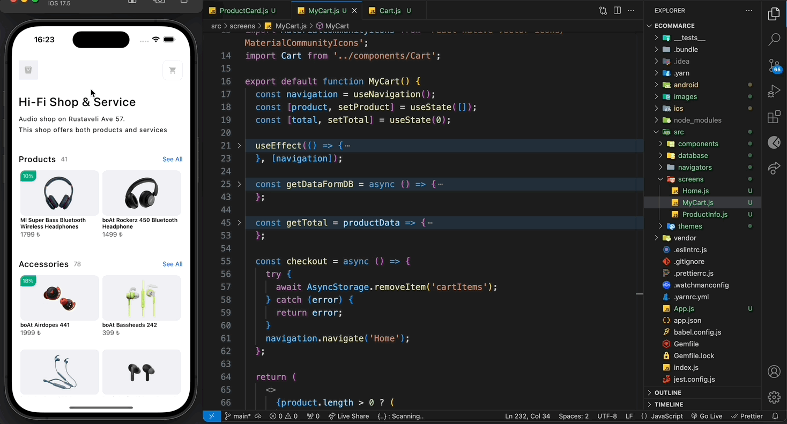

# E-ticaret Uygulaması

Bu proje, React Native kullanarak geliştirilen bir e-ticaret mobil uygulamasıdır. Uygulama, ürünleri listeleme, sepet yönetimi ve kullanıcıların ürün bilgilerini görüntülemesine olanak tanır.

## Proje Yapısı

- `App.js`: Uygulamanın ana giriş noktası. Yönlendirme ve genel yapı burada tanımlanır.
- `src/`: Uygulamanın tüm kaynak kodlarını içerir.
  - `components/`: Tekrarlanan UI bileşenlerini içerir.
  - `navigators/`: Uygulamanın navigasyon yapılandırmasını içerir.
  - `screens/`: Farklı ekran bileşenlerini içerir.
  - `themes/`: Renkler ve temalar gibi stil dosyalarını içerir.
  - `database/`: Örnek veri ve resim dosyalarını içerir.
- `assets/`: Uygulama için gerekli statik dosyalar.

### Sepet Yönetimi

- **Ürün Ekleme**: Ürün detay sayfasında "Add to cart" düğmesine basarak ürünü sepete ekleyebilirsiniz.
- **Ürün Kaldırma**: Sepet sayfasında ürünün yanındaki çöp kutusu simgesine basarak ürünü sepetten kaldırabilirsiniz.
- **Miktar Güncelleme**: Sepet sayfasında ürün miktarını artırmak veya azaltmak için artı ve eksi düğmelerini kullanabilirsiniz.

### Ürün Bilgisi Görüntüleme

- Ürünler ve aksesuarlar ana sayfada listelenir. Ürün kartına dokunarak ürün detay sayfasına gidebilirsiniz.

### Ekran Görüntüsü

